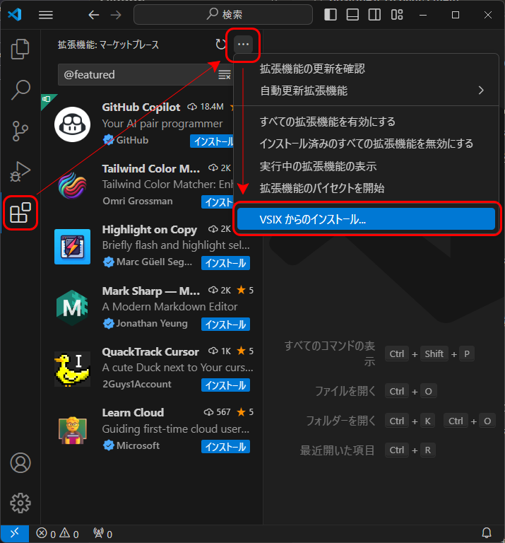

# Open File from Line

This VS Code extension allows you to open a file from the file path specified in the current line of the active editor.

## Features

- Open a file from the file path in the current line
- Supports absolute and relative file paths
- Keyboard shortcut: `Ctrl+Alt+O` (Windows/Linux) or `Cmd+Alt+O` (Mac)

## Installation

1. Download the `open-file-from-line-0.0.1.vsix` file from the releases page.
2. Open VS Code and go to the Extensions view.
3. Click on the `...` icon and select "Install from VSIX...".
4. Select the downloaded `open-file-from-line-0.0.1.vsix` file and click "Install".

## Usage

1. Open a file in VS Code.
2. Place the cursor on a line containing a file path.
3. Press `Ctrl+Alt+O` (Windows/Linux) or `Cmd+Alt+O` (Mac), or open the Command Palette and run the "Open File from Line" command.

The specified file will be opened in a new tab.

## License

This extension is released under the MIT License.

## Build & Install

1. このプラグインに必要なパッケージのダウンロード
	```
	npm install
	```

1. vsceのインストール(vsceをインストールしていない場合)
	```
	npm install -g vsce
	```

1. パッケージのビルド
	```
	vsce package
	```

1. VisualStudioCodeのプラグインメニューからファイルをインストールする


